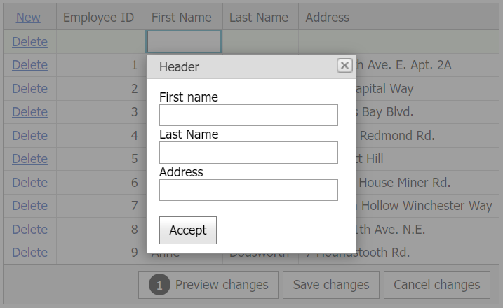

# Grid View for ASP.NET Web Forms - How to implement a popup edit form in batch mode
<!-- run online -->
**[[Run Online]](https://codecentral.devexpress.com/t286169/)**
<!-- run online end -->

This example demonstrates how to use a popup control to edit grid data in batch mode.



## Overview

Follow the steps below:

1. Create the [Grid View](https://docs.devexpress.com/AspNet/DevExpress.Web.ASPxGridView) control and set its [Mode](https://docs.devexpress.com/AspNet/DevExpress.Web.ASPxGridViewEditingSettings.Mode) property to `Batch`.

    ```aspx
    <dx:ASPxGridView ID="ASPxGridView1" ClientInstanceName="grid" runat="server" ... >
        <ClientSideEvents BatchEditStartEditing="onStartEdit" />
        <SettingsEditing Mode="Batch" />
        <!-- ... -->
    </dx:ASPxGridView>
    ```

2. Create a popup control and fill its content with child controls.

    ```aspx
    <dx:ASPxPopupControl ID="ASPxPopupControl1" runat="server" ClientInstanceName="popup" ... >
        <ClientSideEvents Shown="onShown" CloseButtonClick="onCloseButtonClick" />
        <ContentCollection>
            <dx:PopupControlContentControl>
                <dx:ASPxLabel ID="ASPxLabel1" runat="server" Text="First name" />
                <dx:ASPxTextBox ID="TextBoxFirstName" ClientInstanceName="textBoxFirstName" runat="server" />
                <dx:ASPxLabel ID="ASPxLabel2" runat="server" Text="Last Name" />
                <dx:ASPxTextBox ID="TextBoxLastName" ClientInstanceName="textBoxLastName" runat="server" />
                <dx:ASPxLabel ID="ASPxLabel3" runat="server" Text="Address" />
                <dx:ASPxTextBox ID="TextBoxAddress" ClientInstanceName="textBoxAddress" runat="server" />
                <br />
                <dx:ASPxButton ID="ASPxButton1" runat="server" Text="Accept" AutoPostBack="false">
                    <ClientSideEvents Click="onAcceptClick" />
                </dx:ASPxButton>
            </dx:PopupControlContentControl>
        </ContentCollection>
    </dx:ASPxPopupControl>
    ```

3. Handle the grid's client-side [BatchEditStartEditing](https://docs.devexpress.com/AspNet/js-ASPxClientGridView.BatchEditStartEditing) event. In the handler, invoke a popup window over the edited row.

    ```js
    var visibleIndex = 0;
    function onStartEdit(s, e) {
        visibleIndex = e.visibleIndex;
        popup.ShowAtElement(grid.GetMainElement());
    }
    ```

4. Handle the popup's client-side `Shown` event. In the handler, call the grid's [GetCellValue](https://docs.devexpress.com/AspNet/js-ASPxClientGridViewBatchEditApi.GetCellValue(visibleIndex-columnFieldNameOrId)) method to get the value of the specified grid cell and assign this value to the popup field.

    ```aspx
    function onShown(s, e) {
        textBoxFirstName.SetText(grid.batchEditApi.GetCellValue(visibleIndex, "FirstName"));
        textBoxLastName.SetText(grid.batchEditApi.GetCellValue(visibleIndex, "LastName"));
        textBoxAddress.SetText(grid.batchEditApi.GetCellValue(visibleIndex, "Address"));
    }
    ```

5. Handle the **Accept** button's client-side `Click` event. In the handler, do the following:

   * Get the new value of the popup field.
   * Call the grid's [SetCellValue](https://docs.devexpress.com/AspNet/js-ASPxClientGridViewBatchEditApi.SetCellValue(visibleIndex-columnFieldNameOrId-value)) to assign this value to the specified grid cell.
   * Hide the popup window.

    ```aspx
    function onAcceptClick(s, e) {
        grid.batchEditApi.SetCellValue(visibleIndex, "FirstName", textBoxFirstName.GetText());
        grid.batchEditApi.SetCellValue(visibleIndex, "LastName", textBoxLastName.GetText());
        grid.batchEditApi.SetCellValue(visibleIndex, "Address", textBoxAddress.GetText());
        popup.Hide();
    }
    ```

6. Handle the popup's client-side `CloseButtonClick` event. In the handler, call the grid's [ResetChanges](https://docs.devexpress.com/AspNet/js-ASPxClientGridViewBatchEditApi.ResetChanges(visibleIndex)) method to discard changes for the specified grid row.

    ```js
    function onCloseButtonClick(s, e) {
        if (visibleIndex <= -1)
            grid.batchEditApi.ResetChanges(visibleIndex);
    }
    ```

## Files to Review

* [Default.aspx](./CS/Default.aspx) (VB: [Default.aspx](./VB/Default.aspx))
* [Default.aspx.cs](./CS/Default.aspx.cs) (VB: [Default.aspx.vb](./VB/Default.aspx.vb))

## Documentation

* [Grid in Batch Edit Mode](https://docs.devexpress.com/AspNet/16443/components/grid-view/concepts/edit-data/batch-edit-mode)
